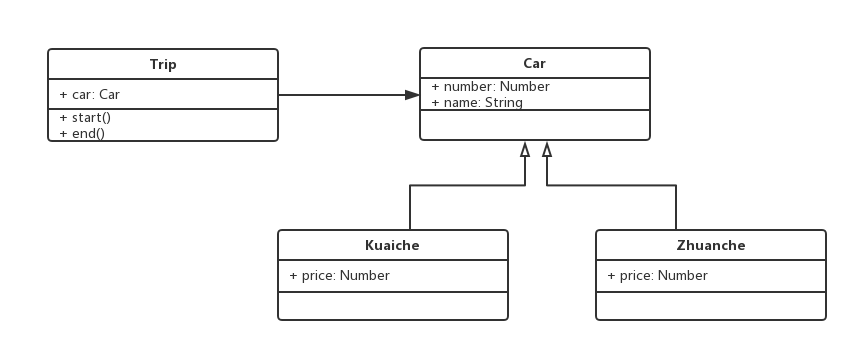

# 1. 面试题
+ 考察面向对象和设计能力

# 2. 试题1
+ 面向对象
+ 继承
+ 抽象能力

### 2.1 题目
+ 打车时，可以打专车或者快车，任何车都有车牌号和名称。
+ 不同车价格不同，快车每公里1元，专车每公里2元。
+ 行程开始时，显示车辆信息。
+ 行程结束时，显示打车金额(假定行程为5公里)。

### 2.2 问题
+ 画出UML类图


+ 使用ES6语法写出该示例
```javascript
class Car {
  constructor(number, name) {
    this.number = number;
    this.name = name;
  }
}

class Kuaiche extends Car {
  constructor(number, name) {
    super(number, name);
    this.price = 1;
  }
}

class Zhuanche extends Car {
  constructor(number, name) {
    super(number, name);
    this.price = 2;
  }
}

class Trip {
  constructor(car) {
    this.car = car;
	}

  start() {
    console.log(`行程开始，车辆类型: ${this.car.name}，车牌号: ${this.car.number}`);
  }

  end() {
    console.log(`行程结束，价格: ${this.car.price * 5}元`);
  }
}

let carType = new Kuaiche('100', '红旗');
let trip = new Trip(carType);
trip.start();
trip.end();
```

# 3. 试题2
### 3.1 题目
+ 某停车场，分3层，每层100个车位。
+ 每个车位都能监控到车辆的驶入和离开。
+ 车辆进入前，显示每层的空余车位数量。
+ 车辆进入时，摄像头可以识别到车牌号和时间。
+ 车辆出来时，出口显示器显示车牌号和停车时长。

### 3.2 问题
+ 画出UML类图


+ 使用代码写出该示例
```javascript
// 车辆
class Car {
  constructor(num) {
    this.num = num;
  }
}

// 摄像头
class Camera {
  shot(car) {
    return {
      num: car.num,
      inTime: Date.now()
    }
  }
}

// 显示屏
class Screen {
  show(car, inTime) {
    console.log(`%c车牌号: ${car.num}`, 'color: red');
    console.log(`%c停车: ${Date.now() - inTime}s`, 'color: red');
  }
}

// 停车场
class Park {
  constructor(floors) {
    this.floors = floors || [];
    this.camera = new Camera();
    this.screen = new Screen();
    this.carList = {};    // 存储摄像头拍摄返回的车辆信息
  }

  in(car) {
    // 通过摄像头获取信息
    const info = this.camera.shot(car);
    // 停到某个停车位
    const i = parseInt(Math.random() * 100 % 100);
    const place = this.floors[0].places[i];
    place.in();
    info.place = place;
    // 记录信息
    this.carList[car.num] = info;
  }

  out(car) {
    // 获取信息
    const info = this.carList[car.num];
    // 将停车位清空
    const place = info.place;
    place.out();
    // 显示时间
    this.screen.show(car, info.inTime);
    // 清空记录
    delete this.carList[car.num];
  }

  emptyNum() {
    return this.floors.map(floor => {
      return `${floor.index} 层还有 ${floor.emptyPlaceNum()} 个车位`;
    }).join('\n');
  }
}

// 层
class Floor {
  constructor(index, places) {
    this.index = index;
    this.places = places;
  }

  emptyPlaceNum() {
    let num = 0;
    this.places.forEach(p => {
      if (p.empty) {
        num += 1;
      }
    });
    return num;
  }
}

// 车位
class Place {
  constructor() {
    this.empty = true;
  }

  in() {
    this.empty = false;
  }

  out() {
    this.empty = true;
  }

}

// 测试
// 初始化停车场
const floors = [];
for (let i = 0; i < 3; i++) {
  const places = [];
  for (let j = 0; j < 100; j++) {
    places[j] = new Place();
  }
  floors[i] = new Floor(i + 1, places);
}

const park = new Park(floors);
const car1 = new Car(100);
const car2 = new Car(200);
const car3 = new Car(300);

console.log(park);
console.log(car1);

console.log('第1辆车进入');
console.log(park.emptyNum());
park.in(car1);

console.log('第2辆车进入');
console.log(park.emptyNum());
park.in(car2);

console.log('第1辆车离开');
console.log(park.emptyNum());
park.out(car1);

console.log('第2辆车离开');
console.log(park.emptyNum());
park.out(car2);

park.in(car3);
console.log('第3辆车进入');
console.log(park.emptyNum());

console.log('第3辆车离开');
console.log(park.emptyNum());
park.out(car3);
```

