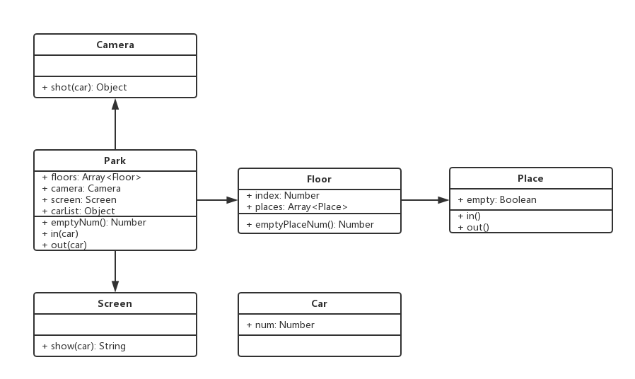

# 1. 面试题
+ 考察面向对象和设计能力

# 2. 试题1
+ 面向对象
+ 继承
+ 抽象能力

### 2.1 题目
+ 打车时，可以打专车或者快车，任何车都有车牌号和名称。
+ 不同车价格不同，快车每公里1元，专车每公里2元。
+ 行程开始时，显示车辆信息。
+ 行程结束时，显示打车金额(假定行程为5公里)。

### 2.2 问题
+ 画出UML类图


+ 使用ES6语法写出该示例
```javascript
class Car {
  constructor(number, name) {
    this.number = number;
    this.name = name;
  }
}

class Kuaiche extends Car {
  constructor(number, name) {
    super(number, name);
    this.price = 1;
  }
}

class Zhuanche extends Car {
  constructor(number, name) {
    super(number, name);
    this.price = 2;
  }
}

class Trip {
  constructor(car) {
    this.car = car;
	}

  start() {
    console.log(`行程开始，车辆类型: ${this.car.name}，车牌号: ${this.car.number}`);
  }

  end() {
    console.log(`行程结束，价格: ${this.car.price * 5}元`);
  }
}

let carType = new Kuaiche('100', '红旗');
let trip = new Trip(carType);
trip.start();
trip.end();
```

# 3. 试题2
### 3.1 题目
+ 某停车场，分3层，每层100个车位。
+ 每个车位都能监控到车辆的驶入和离开。
+ 车辆进入前，显示每层的空余车位数量。
+ 车辆进入时，摄像头可以识别到车牌号和时间。
+ 车辆出来时，出口显示器显示车牌号和停车时长。

### 3.2 问题
+ 画出UML类图


+ 使用代码写出该示例

