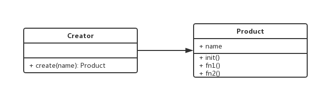

# 1. 工厂模式介绍
+ 将new操作单独封装
+ 遇到new时，就要考虑是否该使用工厂模式

# 2. 举例
+ 去购买汉堡，直接点餐，取餐，不会自己亲手去做
+ 商店要“封装”做汉堡的工作，做好汉堡后直接给消费者

# 3. UML类图


# 4. 示例代码
```javascript
// 工厂模式
class Product {
  constructor(name) {
    this.name = name;
  }

  init() {
    console.log('init');
  }

  func1() {
    console.log('fun1');
  }

  func2() {
    console.log('fun2');
  }

}

class Creator {
  create(name) {
    return new Product(name);
  }
}

let creator = new Creator();
let p = creator.create('mark');
p.init();
p.func1();
p.func2();
```
# 5. 场景
### 5.1 jQuery - $('div')
+ $('div') 和 new $('div') 有什么区别？
+ 书写麻烦，不能使用jQuery的链式操作
+ 一旦jQuery名字变化，将是灾难性的麻烦
```javascript
class JQuery {
  constructor(selector) {
    let slice = Array.prototype.slice;
    let dom = slice.call(document.querySelectorAll(selector));
    let len = dom ? dom.length : 0;
    for (let i = 0; i < len; i++) {
      this[i] = dom[i];
      console.log(this);
      console.log(this[i]);
    }
    this.length = len;
    this.selector = selector || '';
  }
}

window.$ = function (selector) {
  // 工厂模式
  return new JQuery(selector);
};
```
+ 阅读经典lib源码的意义
	+ 学习一些功能的实现方法
	+ 学习设计思路
	+ 强制自己学习模拟
+ 创新和拿来主义
	+ 模仿
	+ 多看，直接拿来主义

### 5.2 React.createElement
+ [在线编译React代码](https://babeljs.io/repl#?babili=false&browsers=&build=&builtIns=false&spec=false&loose=false&code_lz=Q&debug=false&forceAllTransforms=false&shippedProposals=false&circleciRepo=&evaluate=false&fileSize=false&timeTravel=false&sourceType=module&lineWrap=true&presets=es2015%2Creact%2Cstage-2&prettier=false&targets=&version=6.26.0&envVersion=)
+ React代码
```jsx
let profile = <div className="m-profile">
	<h3 className="m-header">Tom & Jerry</h3>
	<p>this is my profile info</p>
</div>;
```
+ 由React.createElement编译后的代码

```javascript
var profile = React.createElement(
		"div",
		{ className: "m-profile" },
		React.createElement(
			"h3",
			{ className: "m-header" },
			"Tom & Jerry"
		),
		React.createElement(
			"p",
			null,
			"this is my profile info"
		)
);
```
### 5.1 vue 异步组件
```javascript
Vue.component('async-component', function(resolve, reject) {
  setTimeout(() => {
    resolve({
    	template: '<div>This is a async component.</div>'
    })
  }, 1000);
})
```

# 6. 设计原则验证
+ 构造函数和创建者分离
+ 符合开放封闭原则

