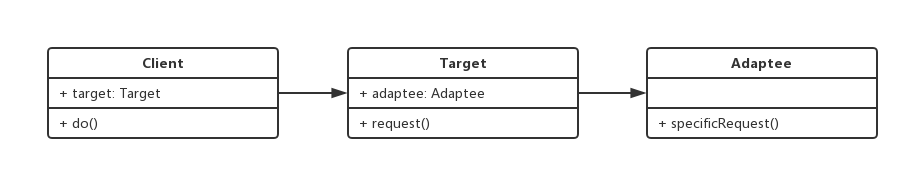

# 1. 适配器模式介绍
+ 旧接口格式和使用者不兼容
+ 中间加一个适配转换接口(类似于电源的转换器)

# 2. UML类图


# 3. 代码示例
```javascript
class Adaptee {
  specificRequest() {
    return '德国标准插头';
  }
}

class Target {
  constructor() {
    this.adaptee = new Adaptee();
  }

  request() {
    let info = this.adaptee.specificRequest();
    return `${info} - 转换器 - 中国标准插头`;
  }

}

let target = new Target();
let res = target.request();
console.log(res);
```

# 4. 应用场景
+ jQuery封装$.ajax，遇到历史原因，尽量避免修改原代码，使用适配器做兼容
+ Vue.computed

```javascript
let vm = new Vue({
	el: '#app',
	data: {
	  message: 'Hello'
	},
	computed: {
	  reversedMessage: function() {
	    return this.message.split('').reverse().join('');
	  }
	}
});
```

# 5. 设计模式验证
+ 将旧接口和使用者进行分离
+ 符合开放封闭原则
