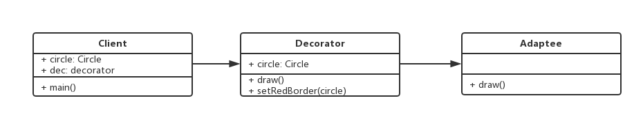

# 1. 装饰器模式介绍
+ 为对象添加新功能
+ 不改变其原有的结构和功能

# 2. UML类图


# 3. 代码
```javascript
class Circle {
  draw() {
    console.log('画一个圆形');
  }
}

class Decorator {
  constructor(circle) {
    this.circle = circle;
  }

  draw() {
    this.circle.draw();
    this.setRedBorder(circle);
  }

  setRedBorder(circle) {
    console.log('设置红色border');
  }

}

let circle = new Circle();
circle.draw();

let dec = new Decorator(circle);
dec.draw();
```
# 4. ES7 装饰器
+ 配置环境`cnpm i babel-plugin-transform-decorators-legacy@1.3.5 -D`
+ 装饰类01
```javascript
function testDesc(isDec) {
  return function (target) {
    target.isDec = isDec;
  }
}

function testNumber(number) {
  return function (target) {
    target.number = number;
  }
}

@testDesc(false)
@testNumber(125)
class Demo {}

console.log(Demo.isDec);
console.log(Demo.number);
```
+ 装饰类02
```javascript
function mixins(...list) {
  return function (target) {
    Object.assign(target.prototype, ...list);
  }
}

const Foo = {
  foo() {
    console.log('foo');
  }
};

@mixins(Foo)
class MyClass {}

let myClass = new MyClass();
myClass.foo();
```

+ 装饰方法
```javascript
class Person {
  constructor() {
    this.first = 'A';
    this.last = 'B';
  }

  @readonly
  name() {
    return `${this.first} ${this.last}`;
  }

}

function readonly(target, name, descriptor) {
  descriptor.writable = false;
  return descriptor;
}

let p = new Person();
console.log(p.name());
// error
// p.name = function () {
//   return '111';
// };
// console.log(p.name());

function log(target, name, descriptor) {
  let oldValue = descriptor.value;
  console.log(target);
  console.log(name);
  console.log(descriptor);
  descriptor.value = function () {
    console.log(`Calling ${name} with `, arguments);
    return oldValue.apply(this, arguments);
  };
  return descriptor;
}

class Math {
  @log
  add(a, b) {
    return a + b;
  }
}

const math = new Math();
const result = math.add(1, 8);
console.log('result, ', result);
```

# 5. core-decorators
```javascript
import {time, readonly} from 'core-decorators';

class Bird {
  @readonly
  @time('sing')
  sing() {
    console.log('hello, singer');
  }
}

var bird = new Bird();
bird.sing();
```
# 6. 设计原则验证
+ 将现有对象和装饰器进行分离，两者独立存在
+ 符合开放封闭原则
