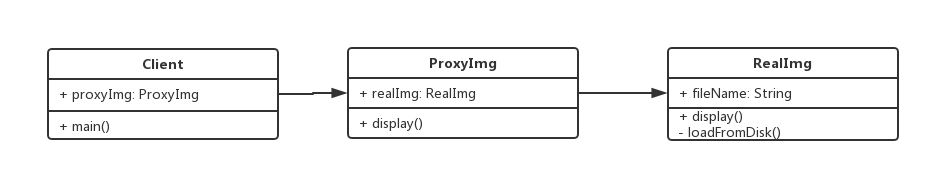

# 1. 代理模式介绍
+ 使用者无权访问目标对象
+ 中间加代理，通过代理做授权和控制

# 2. 功能举例
+ 使用代理访问github.com
+ 明星经纪人

# 3. UML类图


# 4. 代码示例
```javascript
class RealImg {
  constructor(fileName) {
    this.fileName = fileName;
    this.loadFromDisk();
  }

  loadFromDisk() {
    console.log('load file', this.fileName);
  }

  display () {
    console.log('display file', this.fileName);
  }
}


class ProxyImg {
  constructor(fileName) {
    this.realImg = new RealImg(fileName);
  }

  display () {
    this.realImg.display();
  }
}

let proxyImg = new ProxyImg('app.js');
proxyImg.display();
```

# 5. 应用场景
### 5.1 网页事件代理
+ 使用target.nodeName进行代理添加事件
```javascript
const div1 = document.getElementById('div1');
div1.addEventListener('click', function (e) {
	e.preventDefault();
	let target = e.target;
	if (target.nodeName === 'A') {
		console.log(target.innerHTML);
	}
});
```
+ 使用bind.this绑定this的指向
```javascript
const div2 = document.getElementById('div2');
div2.addEventListener('click', function (e) {
	setTimeout(function () {
		console.log(this.innerHTML);
	}.bind(this));
});
```
### 5.2 jQuery $.proxy
+ 使用jQuery普通的事件绑定方式
```javascript
const div3 = $('#div3');
div3.click(function () {
	$(this).addClass('red');
});

const div4 = $('#div4');
div4.click(function () {
	setTimeout(function () {
		$(this).addClass('red');
	}.bind(this));
});
```
+ 使用$.proxy
```javascript
const div5 = $('#div5');
div5.click(function () {
	setTimeout($.proxy(function () {
		$(this).addClass('red');
	}, this));
});
```
### 5.3 ES6 Proxy
```javascript
let star = {
  name: '雪人',
  age: 24,
  phone: 'star: 15612345678'
};
let agent = new Proxy(star, {
  get: function (target, key) {
    if (key === 'phone') {
      return 'agent: 18712345678';
    }
    if (key === 'price') {
      return 12000;
    }
    return target[key];
  },
  set: function (target, key, value) {
    if (key === 'customPrice') {
      if (value < 10000) {
        throw new Error('价格太低');
      } else {
        target[key] = value;
        return true;
      }
    }
  }
});

console.log(agent.name);
console.log(agent.age);
console.log(agent.phone);
console.log(agent.price);
agent.customPrice = 91999;
console.log(agent.customPrice);
```

# 6. 设计原则验证
+ 代理类和目标类分离，隔离开目标类和使用者
+ 符合开放封闭原则

# 7. 适配器模式 VS 代理模式
+ 适配器模式，提供一个不同的接口
+ 代理模式，提供一模一样的接口

# 8. 装饰器模式 VS 代理模式
+ 装饰器模式，扩展功能，原有功能不变，且可以直接使用
+ 代理模式，显示原有功能，但是经过限制或阉割之后的
