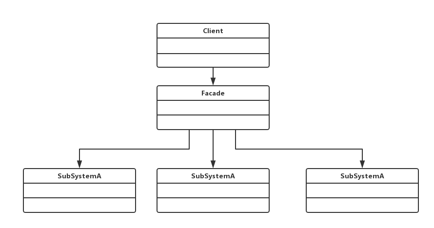

# 1. 外观模式介绍
+ 为子系统中的一组接口提供了一个高层接口
+ 使用者使用这个高层接口

# 2. 功能举例
+ 去医院看病，接待员挂号，门诊，付款，取药

# 3. UML类图


# 4. 代码举例
```javascript
let stopEvent = function( e ){
  e.stopPropagation();
  e.preventDefault();
};

document.getElementById('link').addEventListener('click', function (e) {
  stopEvent(e);
  console.log(e.innerHTML);
});
```

# 5. 设计原则验证
+ 不符合单一职责原则
+ 不符合开放封闭原则
