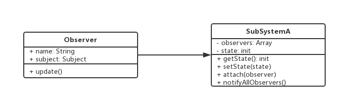

# 1. 观察者模式介绍
+ 发布&订阅
+ 一对一或一对多

# 2. 功能举例
+ 点咖啡，点好之后等着就行了

# 3. UML类图


# 4. 应用场景
## 4.1 网页事件绑定
+ 网页的事件都是观察者模式
+ 一对多的关系，也可以一对一
```javascript
$('btn').click(function() {
  console.log(1);
});

$('btn').click(function() {
  console.log(2);
});

$('btn').click(function() {
  console.log(3);
});
```
## 4.2 Promise
```javascript
function loadImage(src) {
	return new Promise((resolve, reject) => {
		let img = document.createElement('img');
		img.onload = function () {
			resolve(img);
		};
		img.onerror = function () {
			reject('加载失败');
		};
		img.src = src;
	});
}

let src = 'https://www.baidu.com/img/bd_logo1.png';
let result = loadImage(src);

result.then(img => {
	console.log('img.width', img.width);
	return img;
}).then(img => {
	console.log('img.height', img.height);
	return img;
}).then(img => {
	console.log('img.src', img.src);
}).catch(error => {
	console.log(error);
});
```
## 4.3 jQuery callbacks
+ 自定义事件，自定义回调
```javascript
let callbacks = $.Callbacks();
callbacks.add(function (info) {
	console.log('fn1', info);
});

callbacks.add(function (info) {
	console.log('fn2', info);
});

callbacks.add(function (info) {
	console.log('fn3', info);
});

callbacks.fire('gogogo');
callbacks.fire('fire');
```
## 4.4 Node.js自定义事件
```javascript
// 观察者模式之Node.js自定义事件
const EventEmitter = require('events').EventEmitter;

const emitter1 = new EventEmitter();

emitter1.on('some', (...args) => {
  console.log('first some events', args);
});

emitter1.on('some', (...args) => {
  console.log('second some events', args);
});

setTimeout(() => {
  emitter1.emit('some', 'mark', 18);
}, 1000);
```

## 4.3 其他场景
+ Node.js中，处理http请求，多进程通讯
+ Vue和React组件生命周期触发
+ Vue watch

# 5. 设计原则验证
+ 主体和观察者分离，被动监听，属于解耦
+ 符合开放封闭原则
