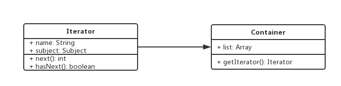

# 1. 迭代器模式介绍
+ 顺序访问一个集合
+ 使用者无需知道集合的内部结构(封装)

# 2. 示例
+ 数组的forEach
+ 伪数组的for循环
+ jQuery的$.each方法

# 3. UML类图

+ UML类图中的getIterator()的作用类似于jQuery的$(data)方法

# 4. 使用场景
### 4.1 jQuery的$.each
```javascript
function each(data) {
	let $data = $(data);
	$data.each((index, elem) => {
		console.log(index, elem);
	});
}
```
### 4.2 ES6的Iterator
+ ES6语法中，有序集合的数据类型已经有很多
+ Array, Set, Map, String, Arguments, TypesArray, NodeList
+ 需要有一个统一的遍历接口来遍历所有数据类型
+ object不是有序集合，可以用Map代替

### 4.3 ES6 Iterator是什么
+ 上边说的数据类型，都有一个`[Symbol.iterator]`属性
+ 属性值是函数，执行函数返回一个迭代器
+ 这个迭代器就有next方法可顺序迭代子元素
+ 可运行`Array.prototype[Symbol.iterator]`
![迭代器模式Array.prototype[Symbol.iterator]](./images/13-迭代器模式Array.prototype%5BSymbol.iterator%5D.png)

```javascript
function each(data) {
  let iterator;
  if (!data[Symbol.iterator]) {
    return false;
  }
  iterator = data[Symbol.iterator]();
  let item = {done: false};
  while (!item.done) {
    item = iterator.next();
    if (!item.done) {
      console.log(item.value);
    } else {
      console.log(item);
    }
  }
}

let s = new Set([1, 2, 3]);
let m = new Map();
m.set('name', 'mark');
m.set('age', 18);
m.set('home', 'beijing');
each(s);
console.log('-----分割线-----');
each(m);
```

# 5. 设计原则验证
+ 迭代器对象和目标对象分离
+ 迭代器将使用者和目标对象隔离开
+ 符合开放封闭原则
