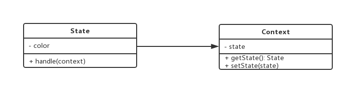

# 1. 状态模式介绍
+ 一个对象有状态变化
+ 每次状态变化都会触发一个逻辑
+ 不能总是用if……else来控制

# 2. 示例
+ 交通信号灯不同颜色的变化

# 3. UML类图


# 4. 红绿灯状态示例代码
```javascript
// 状态
class State {
  constructor(color) {
    this.color = color;
  }

  handle(context) {
    console.log(`%cturn on ${this.color} light`, `color: ${this.color}`);
    context.setState(this);
  }
}

// 主题
class Context {
  constructor() {
    this.state = null;
  }

  getState() {
    return this.state;
  }

  setState(state) {
    this.state = state;
  }
}

let context = new Context();

let green = new State('green');
let red = new State('red');
let yellow = new State('yellow');

// 绿灯亮了
green.handle(context);
console.log(context.getState());
// 红灯亮了
red.handle(context);
console.log(context.getState());
// 黄灯亮了
yellow.handle(context);
console.log(context.getState());
```
# 5. 应用场景
## 5.1 有限状态机
+ 有限个状态，以及在这些状态之间的变化
+ 比如交通信号灯
+ 使用开源lib, javascript-state-machine

```javascript
import StateMachine from 'javascript-state-machine'

const fsm = new StateMachine({
  init: '收藏',
  transitions: [
    {
      name: 'doStore',
      from: '收藏',
      to: '取消收藏'
    },
    {
      name: 'deleteStore',
      from: '取消收藏',
      to: '收藏'
    }
  ],
  methods: {
    // 监听执行收藏
    onDoStore() {
      console.log('收藏成功');
      updateText();
    },
    // 监听取消收藏
    onDeleteStore() {
      console.log('取消收藏');
      updateText();
    }
  }
});

function updateText() {
  $btn1.innerText = fsm.state;
}

let $btn1 = document.getElementById('btn1');

$btn1.addEventListener('click', function (e) {
  e.stopPropagation();
  if (fsm.is('收藏')) {
    fsm.doStore();
  } else {
    fsm.deleteStore();
  }
});

// 初始化文案
updateText();
```

## 5.2 写一个简单的Promise
```javascript
import StateMachine from 'javascript-state-machine'

const fsm = new StateMachine({
  init: 'pending',
  transitions: [
    {
      name: 'resolve',
      from: 'pending',
      to: 'fullfilled'
    },
    {
      name: 'reject',
      from: 'pending',
      to: 'rejected'
    }
  ],
  methods: {
    onResolve(state, data) {
      // state是当前状态机的实例
      // data是fsm.resolve()的参数
      console.log(state);
      data.successList.forEach(fn => fn());
    },
    onReject(state, data) {
      data.failList.forEach(fn => fn());
    }
  }
});

class MyPromise {
  constructor(fn) {
    this.successList = [];
    this.failList = [];
    fn(() => {
      fsm.resolve(this);
    }, () => {
      fsm.reject(this);
    })
  }

  then(successFn, failFn) {
    this.successList.push(successFn);
    this.failList.push(failFn);
  }

}

function loadImg(src) {
  const promise = new MyPromise((resolve, reject) => {
    let img = document.createElement('img');
    img.onload = function () {
      resolve(img);
    };
    img.onerror = function () {
      reject();
    };
    img.src = src;
  });
  return promise;
}

let src = 'https://gitee.com/logo-black.svg';
let result = loadImg(src);

result.then(() => {
  console.log('ok1');
}, () => {
  console.log('fail1');
});

result.then(() => {
  console.log('ok2');
}, () => {
  console.log('fail2');
});
```


# 6. 设计原则验证
+ 将状态对象和主题对象分离，状态的变化逻辑单独处理
+ 符合开放封闭原则
